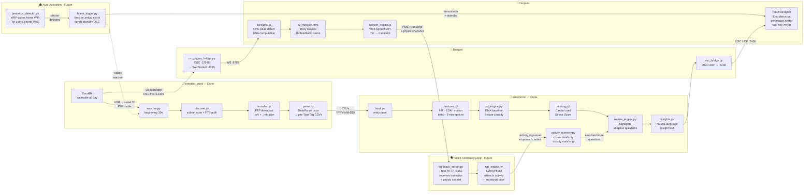
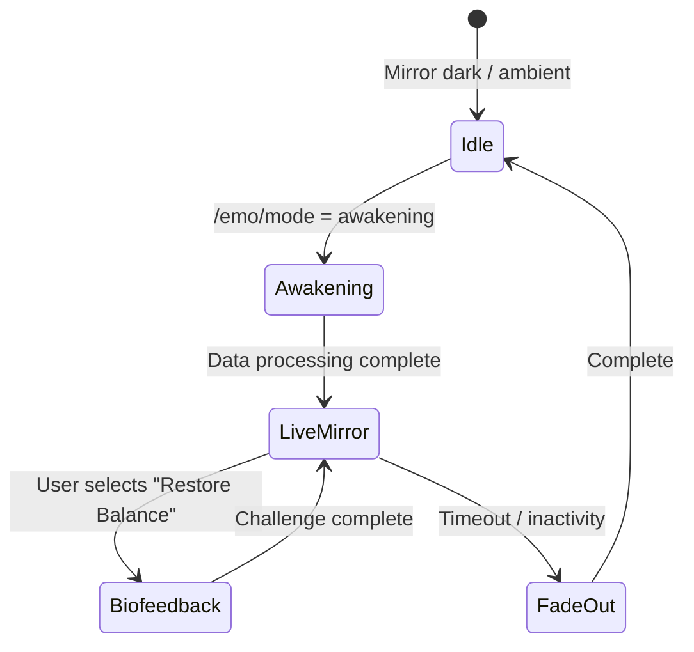

# EmoMirror — Implementation Plan

## 1. Overview & Vision

**EmoMirror** is an interactive "emotional mirror" that transforms a full day of physiological data into a living, breathing reflection of your inner state. When a user wearing an EmotiBit arrives home and the device enters FTP mode, EmoMirror awakens — processing the day's biosignals, learning baselines, inferring emotional states, and rendering a generative human-form visualization in TouchDesigner that mirrors the user's physiological narrative.

The mirror doesn't just show data — it reflects the user's physiological narrative and automatically offers a path to equilibrium through a real-time biofeedback challenge where the user "wins" not by pressing buttons, but by bringing their physiology back to baseline.

---

## 2. What Already Exists

The `emotibit_auto/` module is **already implemented** and handles the first half of the pipeline:

| Module | Status | What It Does |
|:-------|:------:|:-------------|
| [discover.py](file:///d:/Frontier%20Interface/emotibit_auto/discover.py) | ✅ Done | Subnet scan → FTP auth → finds EmotiBit IP, caches to config |
| [transfer.py](file:///d:/Frontier%20Interface/emotibit_auto/transfer.py) | ✅ Done | FTP download of `.csv` + `_info.json` files (skips already-downloaded) |
| [parse.py](file:///d:/Frontier%20Interface/emotibit_auto/parse.py) | ✅ Done | Runs EmotiBit DataParser `.exe` on raw CSVs → per-TypeTag CSVs |
| [watcher.py](file:///d:/Frontier%20Interface/emotibit_auto/watcher.py) | ✅ Done | Main loop: discover → transfer → parse, every 30s |
| [config.json](file:///d:/Frontier%20Interface/emotibit_auto/config.json) | ✅ Done | FTP creds, output dir, subnet range, parser path |

**Key constraints from existing setup:**
- EmotiBit must be **ESP32 Feather Huzzah** (FTP support)
- EmotiBit must be **manually put into FTP mode** (USB + serial `F` command)
- Data goes to: `{output_dir}/YYYY-MM-DD/` as parsed per-TypeTag CSVs
- DataParser produces files like: `2024-09-18_22-59-45_EA.csv`, `..._HR.csv`, `..._AX.csv`, etc.

---

## 3. System Architecture

> Architecture reads **left → right**. Each column is a processing layer.



---

### Auto-Activation Layer (Future Feature)

When the user gets home, the mirror wakes automatically — no manual trigger needed.

| File | Role |
|:-----|:-----|
| **`emomirror/presence_detector.py`** | Background ARP scan on the home network every 15s. When the user's phone MAC address appears, fires an `"arrival"` event. |
| **`emomirror/home_trigger.py`** | Listens for the arrival event. Sends `/emo/mode = "standby"` over OSC → TouchDesigner wakes to a soft ambient glow with *"Welcome home. Connect your EmotiBit."* Also ensures `watcher.py` is running so FTP discovery begins the moment the device is plugged in. |

**Arrival flow:**
`Phone connects to WiFi` → `presence_detector` detects MAC → `home_trigger` wakes mirror to **standby** → user plugs in EmotiBit → `watcher` finds it → full pipeline runs → `/emo/mode = "awakening"`

---

### Voice Feedback Loop (Future Feature)

When a user answers a reflective question in the Daily Review, their spoken reply is captured, understood by an LLM, and fed back into the pipeline — so future sessions ask smarter questions.

| File | Role |
|:-----|:-----|
| **`speech_engine.js`** | Browser-side. Activates the Web Speech API when the mic button is pressed. Streams the transcript back in real time, shows it in the reply input, then POSTs the final text + a snapshot of the current physio context (HR, EDA, state) to `feedback_server.py`. |
| **`emomirror/feedback_server.py`** | Lightweight Flask server on `:5050`. Receives `{ transcript, physio_snapshot, question_id, timestamp }` from the browser. Passes the payload to `nlp_engine.py` and returns a generated follow-up insight to the browser for immediate display. |
| **`emomirror/nlp_engine.py`** | Calls the LLM API (system prompt: *"You are a biofeedback assistant. Extract the activity type, emotional context, and any stress trigger from this user message."*). Returns a structured dict: `{ activity, label, trigger, summary }`. Populates the `_llm_extract()` stub already present in `activity_memory.py`. |
| **`emomirror/activity_memory.py`** | Already exists. `_llm_extract()` is powered by `nlp_engine.py` once implemented. Stores the resulting activity signature as a 5-dim vector, enabling cosine-similarity recall in future review sessions. |

**Feedback flow:**
`User presses mic` → `speech_engine.js` captures voice → transcript POSTed to `feedback_server.py` → `nlp_engine.py` calls LLM API → structured activity data written to `activity_memory.py` → `review_engine.py` uses updated memory to personalise next session's questions

---

### What Changed Since the Initial Plan

| Change | Detail |
|:-------|:-------|
| **Browser-side biofeedback** | `osc_to_ws_bridge.py` bridges Oscilloscope stream (OSC :12345) to WebSocket (:8765). `biosignal.js` runs PPG peak detection + RSA computation in the browser for the challenge UI. |
| **Scoring engine added** | `scoring.py` computes Cardio Load and Stress Score per 5-min epoch (288/day). Motion-gated: stress only counted during sedentary periods (motion ≤ 0.3). |
| **Review engine added** | `review_engine.py` finds highlights (contiguous runs > mean+1.5σ, ≥ 15 min), selects 3 adaptive questions from a 25+ template bank, outputs daily review JSON. |
| **Dual output path** | TouchDesigner handles the mirror display. `ui_mockup.html` handles the browser-based Daily Review dashboard and the Biofeedback challenge game. |
| **Noise-robust signal processing** | `biosignal.js` reduced HR window (8→3 beats) to preserve RSA oscillation. `csv_parser.js` uses 5th–95th percentile normalization to handle EDA saturation spikes (10,000 µS). |

---

## 4. Proposed Changes

---

### Component 1: Integration Hook — Connect to Existing Pipeline

> Watches the parsed data directory for new files and triggers the EmoMirror pipeline.

#### [MODIFY] [watcher.py](file:///d:/Frontier%20Interface/emotibit_auto/watcher.py)
- Add a **callback hook** after successful parse: calls `emomirror.hook.on_new_data(today_dir, new_files)`
- This is a minimal 3-line change to the existing code

```python
# After line 34 in watcher.py:
#     parsed = parse_files(new_files)
# Add:
from emomirror.hook import on_new_data
on_new_data(today_dir, parsed)
```

#### [NEW] emomirror/hook.py
- Entry point called by watcher after new parsed data arrives
- Loads parsed CSVs from `today_dir` (all `_EA.csv`, `_HR.csv`, `_AX.csv`, etc.)
- Triggers feature extraction → ML inference → OSC output
- Also sends `/emo/mode = "awakening"` OSC message to wake up TouchDesigner

---

### Component 2: Feature Extraction & Signal Processing

> Reads the parsed per-TypeTag CSVs and extracts meaningful features.

#### [NEW] emomirror/features.py

**Input:** Parsed CSVs from `emotibit_auto` output, e.g.:
```
emotibit_data/2024-09-18/
  ├── 2024-09-18_22-59-45_EA.csv    # EDA
  ├── 2024-09-18_22-59-45_HR.csv    # Heart Rate
  ├── 2024-09-18_22-59-45_AX.csv    # Accelerometer X
  ├── 2024-09-18_22-59-45_AY.csv    # Accelerometer Y
  ├── 2024-09-18_22-59-45_AZ.csv    # Accelerometer Z
  ├── 2024-09-18_22-59-45_GX.csv    # Gyroscope X
  ├── ...
  ├── 2024-09-18_22-59-45_T1.csv    # Temperature
  └── 2024-09-18_22-59-45_info.json # Metadata
```

**Parsed CSV format (each file):**
```csv
LocalTimestamp,EmotiBitTimestamp,PacketNumber,DataLength,TypeTag,ProtocolVersion,DataReliability,EA
1726714786.598,531473.000,17305,3,EA,1,100,0.030269
```

**Libraries:** `neurokit2`, `heartpy`, `numpy`, `scipy`, `pandas`

**Processing pipeline:**

| Signal Group | TypeTag Files | Features Extracted |
|:-------------|:-------------|:-------------------|
| **Heart / PPG** | `_HR.csv`, `_BI.csv`, `_PI.csv`, `_PR.csv`, `_PG.csv` | Mean HR, HRV (RMSSD, SDNN), HR trend over day |
| **EDA / Stress** | `_EA.csv`, `_EL.csv`, `_SA.csv`, `_SF.csv`, `_SR.csv` | Tonic SCL level, phasic SCR count & amplitude, stress episodes |
| **Motion** | `_AX.csv`, `_AY.csv`, `_AZ.csv`, `_GX.csv` – `_GZ.csv` | Activity magnitude, sedentary %, gesture intensity |
| **Temperature** | `_T1.csv` or `_TH.csv` | Mean skin temp, trend, thermal comfort |

**Segmentation:** Data is split into 5-minute epochs → feature vector per epoch → forms a **daily timeline** of states.

---

### Component 3: ML Engine — Baseline & State Inference

> Learns the user's personal baselines and classifies states across the day.

#### [NEW] emomirror/ml_engine.py

#### 3a. Adaptive Baseline (Per-User)

```python
# Exponential moving average over multiple days
baseline = {
    "hr_mean":  EMA(history, alpha=0.3),
    "hr_std":   EMA(history, alpha=0.3),
    "eda_mean": EMA(history, alpha=0.3),
    "eda_std":  EMA(history, alpha=0.3),
    "activity_mean": EMA(history, alpha=0.3),
    "temp_mean": EMA(history, alpha=0.3),
}
```

- **Day 1 (cold start):** Population-average baselines (HR: 60–80 BPM, EDA: 1–5 µS)
- **Day 2+:** Blend personal history via Bayesian updating
- Stored as `baseline_model.joblib` per user

#### 3b. State Classification

Each 5-minute epoch gets classified by deviation from baseline:

| State | Detection Rule |
|:------|:---------------|
| 😌 **Calm** | HR < baseline + 0.5σ, EDA < baseline + 0.5σ, motion low |
| 😰 **Stressed** | HR > baseline + 1.5σ AND SCR_freq > baseline + 2σ |
| 😟 **Anxious** | HR > baseline + 1σ, EDA > baseline + 1.5σ, activity LOW |
| 🏃 **Active** | Activity > baseline + 2σ, HR > baseline + 2σ |
| 😴 **Fatigued** | HR < baseline − 0.5σ, temp declining, activity near-zero |
| 🤯 **Overstimulated** | HR > baseline + 2σ, EDA > baseline + 2σ, gyro variance HIGH |

- **State Persistence:** States are determined based on deviations from the adaptive baseline.
- **Rules Engine:** Simple rule-based thresholds are used for the MVP.

#### 3c. Daily Insights Generator

Produces text insights from the day's state timeline:
```python
insights = [
    "You were most active between 2–4 PM — HR peaked at 142 BPM",
    "3 stress episodes detected (10:30 AM, 1:15 PM, 5:45 PM)",
    "EDA was 40% above baseline during the afternoon",
    "You spent 6.2 hours in a calm state",
]
```

---

### Component 4: OSC Bridge to TouchDesigner

> Sends all processed data from Python to TouchDesigner.

#### [NEW] emomirror/osc_bridge.py

**Library:** `python-osc`, sends to `localhost:7400`

**OSC Schema:**

| Address | Type | Description |
|:--------|:-----|:------------|
| `/emo/mode` | string | `"idle"` / `"awakening"` / `"playback"` / `"realtime"` / `"biofeedback"` |
| `/emo/state/current` | string | Current state name (calm, stressed, anxious, etc.) |
| `/emo/state/color/r` | float | State color R (0–1) |
| `/emo/state/color/g` | float | State color G (0–1) |
| `/emo/state/color/b` | float | State color B (0–1) |
| `/emo/state/intensity` | float | 0.0–1.0 how intense the state is |
| `/emo/state/glitch` | float | 0.0–1.0 distortion level (stress → glitch) |
| `/emo/hr/current` | float | Current HR value |
| `/emo/hr/baseline` | float | Personal baseline HR |
| `/emo/hr/deviation` | float | Deviation from baseline in σ |
| `/emo/eda/current` | float | Current EDA value |
| `/emo/eda/baseline` | float | Personal baseline EDA |
| `/emo/eda/deviation` | float | Deviation from baseline in σ |
| `/emo/motion/level` | float | 0.0–1.0 activity level |
| `/emo/temp/current` | float | Skin temperature °C |
| `/emo/insight` | string | Current insight text |
| `/emo/timeline/progress` | float | 0.0–1.0 day playback progress |
| `/emo/biofeedback/active` | int | 0 or 1 |
| `/emo/biofeedback/progress` | float | 0.0–1.0 progress toward baseline |
| `/emo/biofeedback/scene` | string | Visual metaphor name |

> [!NOTE]
> Port 7400 for EmoMirror → TouchDesigner. The existing EmotiBit Oscilloscope uses port 12345 for its own OSC output. Both can coexist.

---

### Component 5: TouchDesigner Visual Engine

> The heart of the mirror. Renders the generative avatar and interactive UI.

#### [NEW] touchdesigner/EmoMirror.toe

#### 5a. State Machine (Python DAT)



#### 5b. Generative Avatar Design (Two-Way Mirror Constraints)

An **abstract human-form silhouette** made of particles, flowing lines, and organic geometry — NOT a realistic human.

> [!IMPORTANT]
> **Hardware Constraint:** Because the display sits behind a **two-way mirror**, all backgrounds in TouchDesigner MUST be pure black (`#000000`). Black pixels render as transparent reflection, while bright/colored pixels shine through the glass. Do not use ambient background colors.

**State-to-Visual Mapping:**

| State | Body Color | Face/Form | Particles | Animation |
|:------|:-----------|:----------|:----------|:----------|
| 😌 **Calm** | Deep blue / teal | Smooth, symmetrical | Slow orbital flow | Gentle breathing |
| 😰 **Stressed** | Orange / amber | Glitched, fragmented | Chaotic, erratic | Fast, jittery |
| 😟 **Anxious** | Yellow-orange | Warped, asymmetric | Dense, swirling | Trembling |
| 🏃 **Active** | Bright green / cyan | Sharp, defined | Fast directional | Energetic pulses |
| 😴 **Fatigued** | Muted purple / grey | Melting, drooping | Sparse, falling | Very slow |
| 🤯 **Overstimulated** | Red / hot pink | Heavily glitched | Explosive, scattered | Strobing |

**TouchDesigner Node Chain:**
```
OSC In CHOP → Select → Math (remap) →
    ├── Noise SOP  (body distortion ← glitch factor)
    ├── Particle SOP (density/speed ← intensity)
    ├── GLSL TOP    (color shader ← state color)
    ├── Feedback TOP (trails ← motion level)
    └── Text TOP    (insights overlay)
```

#### 5d. UI Overlays (Live Mirror)

As soon as the mirror awakens into Live Mirror mode, the UI displays:
- Current state label & live avatar (center)
- HR + EDA indicators (bottom corners, subtle)
- **Primary CTA Button:**
  - [Restore Balance] (Triggers Biofeedback Challenge)

---

---

### Component 7: Biofeedback Challenge

> Real-time 3-minute challenge where the user regulates their body to "win."

#### [NEW] emomirror/biofeedback.py

**Data flow for real-time:**
```
EmotiBit (WiFi) → Oscilloscope → OSC (port 12345) → biofeedback.py → OSC (port 7400) → TouchDesigner
```

**Unified Abstract Scene (Particle Cleansing):**

Instead of multiple literal scenes (clouds, water), the biofeedback challenge uses **one highly-polished, unified particle system** representing the user's avatar. It dynamically changes based on real-time physiology:

| Phase | Visual State of Avatar | Data Mapping |
|:------|:-----------------------|:-------------|
| **1. The Storm** | Asymmetric, distorted form. Particles are chaotic, red/orange, high turbulence. | `overall_progress` near 0.0 |
| **2. The Focus** | Shape stabilizes. Particle speed and turbulence slowly decrease. | `overall_progress` 0.1 to 0.8 |
| **3. The Blooming** | Avatar becomes perfectly symmetrical, clear, and bright. Particles turn teal/blue and flow in a beautiful expanding orbital pattern (like a blooming flower/aura). | `overall_progress` > 0.9 |

**Progress formula:**
```python
hr_prog  = 1.0 - clamp(|hr - hr_baseline| / (2 * hr_std), 0, 1)
eda_prog = 1.0 - clamp(|eda - eda_baseline| / (2 * eda_std), 0, 1)
motion_prog = 1.0 - clamp(motion_level, 0, 1)

overall = 0.4 * hr_prog + 0.4 * eda_prog + 0.2 * motion_prog
# Sent as /emo/biofeedback/progress (0→1 = scene completes)
```

**The user wins by regulating their body** — slow breathing, sitting still, relaxing — NOT by pressing buttons.

#### On-Screen Instructions & UX Flow

When the user selects `[Biofeedback Challenge]` from the Live Mirror menu, the UI guides them seamlessly without needing an external manual:

**1. Intro & Syncing (0:00 - 0:10)**
* **Text on screen:** *"Syncing with your body..."* (A subtle glowing circle expands and contracts, matching the user's real-time heart rate).
* **Instructions appear:** *"Here, you control the environment with your mind and body. There are no buttons to press. Your goal is to find your center."*

**2. The Challenge Begins (0:10 - 2:50)**
* The Live Avatar fades out, and the chosen visual metaphor (e.g., Storm Clouds) fills the mirror.
* **Initial Prompt:** *"Breathe slowly. Relax your shoulders. Clear the storm."*
* **Real-time Contextual Prompts (Driven by Python backend):**
  * If HR isn't dropping: *"Inhale... Exhale..."* (A visual breathing pacer circle appears to guide a 4-7-8 breathing pattern).
  * If Motion is too high: *"Try to soften your posture and sit completely still."*
  * As EDA drops (stress reduces): *"You are doing great. Keep letting go."*
* **Progress Indicator:** A minimalist, glowing ring at the bottom of the mirror fills up as the `overall_progress` metric approaches 1.0.

**3. Success / Conclusion (2:50 - 3:00)**
* The visual metaphor reaches its beautiful conclusion (e.g., the clouds fully part, the garden blooms).
* **Text on screen:** *"You've returned to your baseline. Carry this calm with you."*
* The screen lingers on the peaceful visual for 10 seconds before smoothly fading back to the default Live Mirror avatar.

---

---

## 5. File Structure

```
d:/Frontier Interface/
├── README.md
├── EmotiBit_Guide.md
├── emotibit_auto_transfer_plan.md
├── implementation_plan.md      # ← NEW
│
├── emotibit_auto/              # ✅ EXISTING — data pipeline
│   ├── config.json
│   ├── discover.py
│   ├── transfer.py
│   ├── parse.py
│   ├── watcher.py              # ← MODIFY: add hook call
│   ├── requirements.txt
│   └── README.md
│
├── emomirror/                  # 🆕 NEW — EmoMirror backend
│   ├── __init__.py
│   ├── config.py               # Paths, ports, thresholds
│   ├── hook.py                 # Entry point (called by watcher)
│   ├── features.py             # Signal processing
│   ├── ml_engine.py            # Baseline + state inference
│   ├── biofeedback.py          # Real-time biofeedback logic
│   ├── osc_bridge.py           # OSC sender to TouchDesigner
│   ├── insights.py             # Natural-language insight generation
│   └── requirements.txt        # neurokit2, heartpy, python-osc, pandas
│
├── data/                       # User data (auto-created)
│   └── {user_id}/
│       └── baseline_model.joblib
│
├── touchdesigner/              # 🆕 NEW — TouchDesigner project
│   ├── EmoMirror.toe
│   ├── scripts/
│   │   ├── state_machine.py
│   │   └── biofeedback_controller.py
│   └── assets/
│       ├── shaders/
│       └── textures/
│
└── docs/
    ├── architecture.md
    └── osc_schema.md
```

---

## 6. End-to-End Flow

```mermaid
sequenceDiagram
    participant U as 👤 User
    participant EB as 📡 EmotiBit
    participant WA as ⚙️ watcher.py (existing)
    participant EM as 🧠 emomirror/
    participant TD as 🎨 TouchDesigner

    Note over U,EB: User wears EmotiBit all day, data saves to SD card
    U->>EB: Arrives home, plugs USB, sends "F" → FTP mode
    WA->>WA: discover.py finds EmotiBit IP
    WA->>WA: transfer.py downloads .csv + _info.json via FTP
    WA->>WA: parse.py runs DataParser → per-TypeTag CSVs
    WA->>EM: hook.on_new_data(today_dir, parsed_files)

    EM->>EM: features.py → extract HR, EDA, motion, temp features
    EM->>EM: ml_engine.py → compare to baseline → classify states
    EM->>EM: insights.py → generate daily insights
    EM->>TD: OSC /emo/mode = "awakening"
    TD->>TD: 🪞 Mirror glows to life

    Note over TD: Live Mirror Mode (Default)
    EM->>TD: OSC live state + daily insights
    TD->>TD: Avatar reflects current state
    TD->>TD: UI shows [Restore Balance] button

    Note over TD: User Interaction
    U->>TD: Clicks [Restore Balance]
    
    rect rgb(30, 40, 50)
    Note over TD: Biofeedback Mode
    EB->>EM: Real-time stream (via Oscilloscope OSC)
    EM->>TD: /emo/biofeedback/progress (increasing as user calms)
    TD->>TD: Avatar stabilizes & blooms 🌸
    Note over TD: User reaches baseline → Scene completes
    end
```



---

## 7. Technology Stack

| Layer | Technology |
|:------|:-----------|
| **Data Pipeline** | `emotibit_auto/` (existing) — FTP + DataParser |
| **Signal Processing** | NeuroKit2, HeartPy, SciPy, Pandas |
| **Machine Learning** | scikit-learn, joblib |
| **Communication** | python-osc (port 7400) |
| **Visualization** | TouchDesigner (EmoMirror.toe) |
| **Real-time Stream** | EmotiBit Oscilloscope → OSC (port 12345) → biofeedback.py |

---

## 8. Open Questions

✅ *All open questions have been resolved.* The hardware constraints (two-way mirror), demo scope (unified scene, simulated preference), and interaction methods (touch screen, dual-app setup) have all been confirmed.

---

## 9. Verification Plan

### Automated Tests
- `pytest` for feature extraction (known CSV → expected features)
- `pytest` for state inference rules (synthetic data → expected states)
- OSC round-trip test (Python sends → verify TouchDesigner receives)

### Manual Verification
1. **Pipeline test:** Drop a real EmotiBit recording into `emotibit_data/YYYY-MM-DD/` → verify features + states
2. **OSC test:** Send mock states → verify avatar responds in TouchDesigner
3. **Biofeedback test:** Simulate decreasing HR/EDA → verify visual metaphor progresses
4. **End-to-end:** Full watcher → hook → features → ML → OSC → TouchDesigner flow
